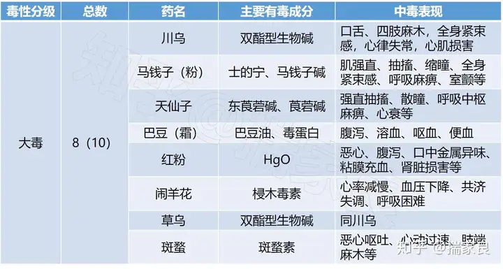
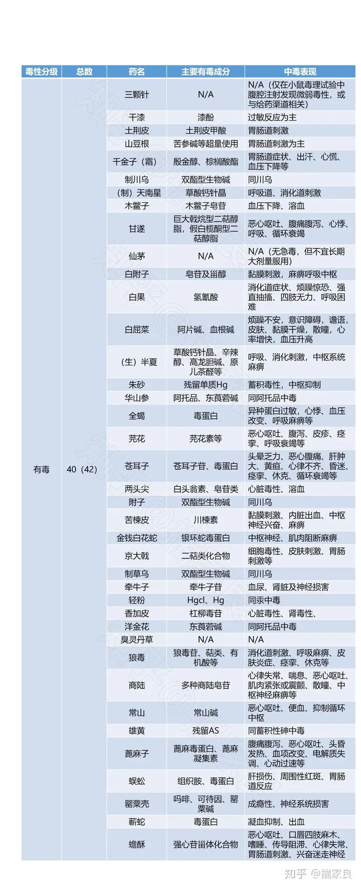
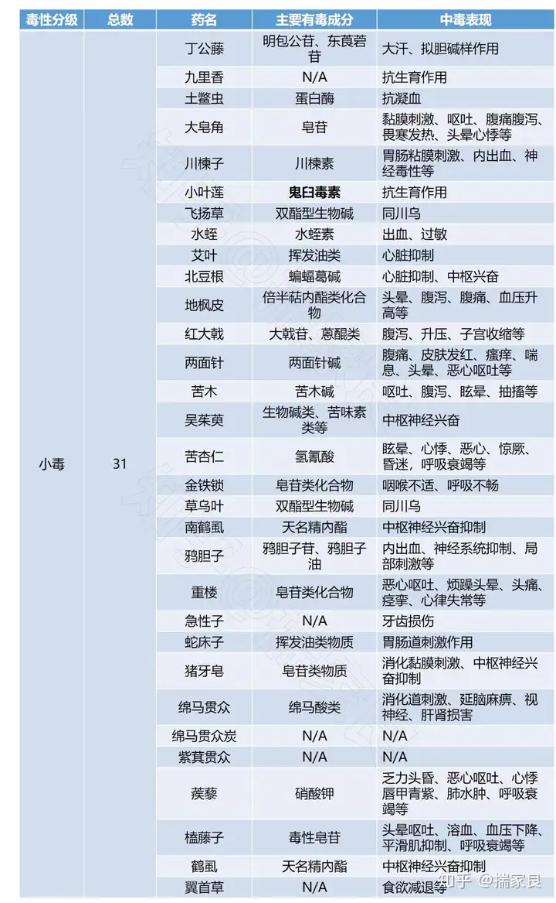

# 不要中医！不要中医！不要中医！

我就问一句，天底下还有任何一个学科拿着千年前的古书当宝贝吗？

譬如，物理，有谁让你看牛顿的《自然哲学的数学原理》？

譬如，生物，有大学是学亚里士多德的《动物志》吗？

譬如，西医，现在还有人学哈维的《血液循环论》吗？

这些著作未必就没有可取之处，但它们早已被更简明，更接近真理的东西所取代了。

**只有一种东西会拿着几百年上千年以前的古书古人顶礼膜拜，那就是宗教。**

## [如果我往中药里面掺西药卖能成为名中医吗？](https://www.zhihu.com/question/637778683/answer/3514040522)
- [现代医药成份作用大全](../现代医药/README.md)

## 毒性中药材整理

