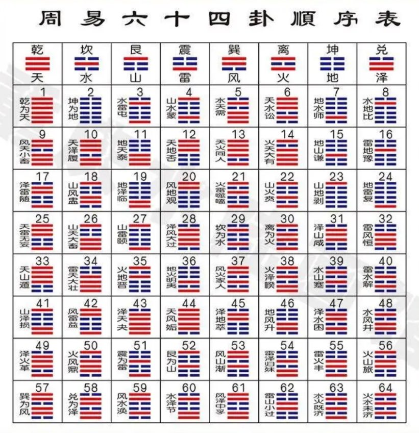
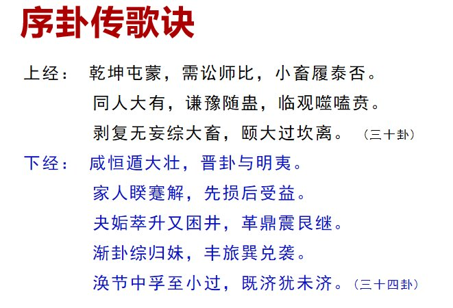

《周易》64卦读音  
1、乾：qián 
2、坤：kūn 
3、屯：zhūn   
4、蒙：méng  
5、需：xū  
6、讼：sòng  
7、师：shī  
8、比：bì  
9、小畜：xiǎo xù  
10、履：lǚ  

11、泰：tài  
12、否：pǐ  
13、同人：tóng rén  
14、大有：dà yōu  
15、谦：qiān  
16、豫：yǜ  
17、随：suí 
18、蛊：gǔ  
19、临：lín 
20、观：guān  

21、噬嗑：shì hé  
22、贲：bì  
23、剥：bō  
24、复：fù  
25、无妄：wú wàng  
26、大畜：dà xù  
27、颐：yí  
28、大过：dà guò  
29、坎：kǎn  
30、离：lí  

31、咸：xián  
32、恒：héng  
33、遁：dùn  
34、大壮：dà zhuàng  
35、晋：jìn  
36、明夷：míng yí  
37、家人：jiā rén  
38、睽：kuí  
39、蹇：jiǎn  
40、解：xiè  

41、损：sǔn  
42、益：yì  
43、夬：guài  
44、姤：gòu  
45、萃：cuì 
46、升：shēng  
47、困：kùn  
48、井：jǐng  
49、革：gé  
50、鼎：dǐng  

51、震：zhèn  
52、艮：gèn  
53、渐：jiàn  
54、归妹：guī mèi  
55、丰：fēng  
56、旅：lǚ  
57、巽：xùn  
58、兑：duì  
59、涣：huàn  
60、节：jié  

61、中孚：zhōng fú  
62、小过：xiǎo guò  
63、既济：jì jì  
64、未济：wèi ji 