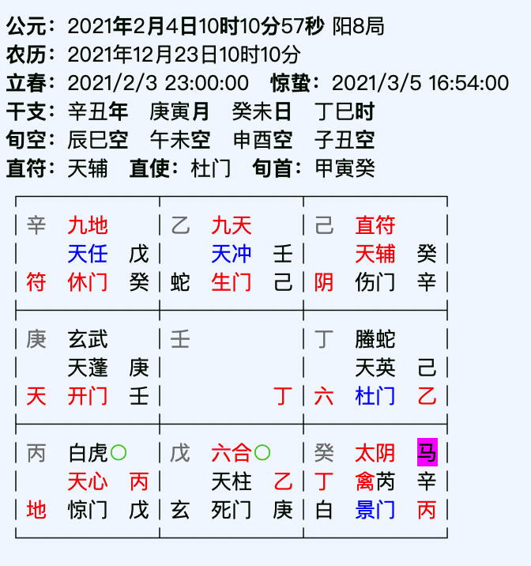

# 奇门案例汇总

### 案例001（射覆）

群里的老师当时让同学们起盘问发生了什么事？

当时老师其实发的是语音，让我们大家断发生了什么事，不同的同学有不同的办法，我当时用的是奇门法

日干癸临坤宫，伤门（代表汽车）入墓，且临辛，且门破，断跟车有关，违章或者发生事故，因为辛为犯错误嘛，但又入墓，且门破，所以断可能汽车有损伤，拉去车库修理。

反馈：因为驾驶证过期，被警察叔叔扣留车，要求年检后去取车

总结：伤门入墓原来是是汽车被扣留，犯错误原来是驾驶证过期违章驾驶

后来老师又问车是什么颜色？

断：伤门五行属木，临坤宫为入墓，木入墓，如同被烧后或者被深埋，所以颜色呈黑色，汽车为黑色，反馈为黑色

------

### 案例002（感情）

