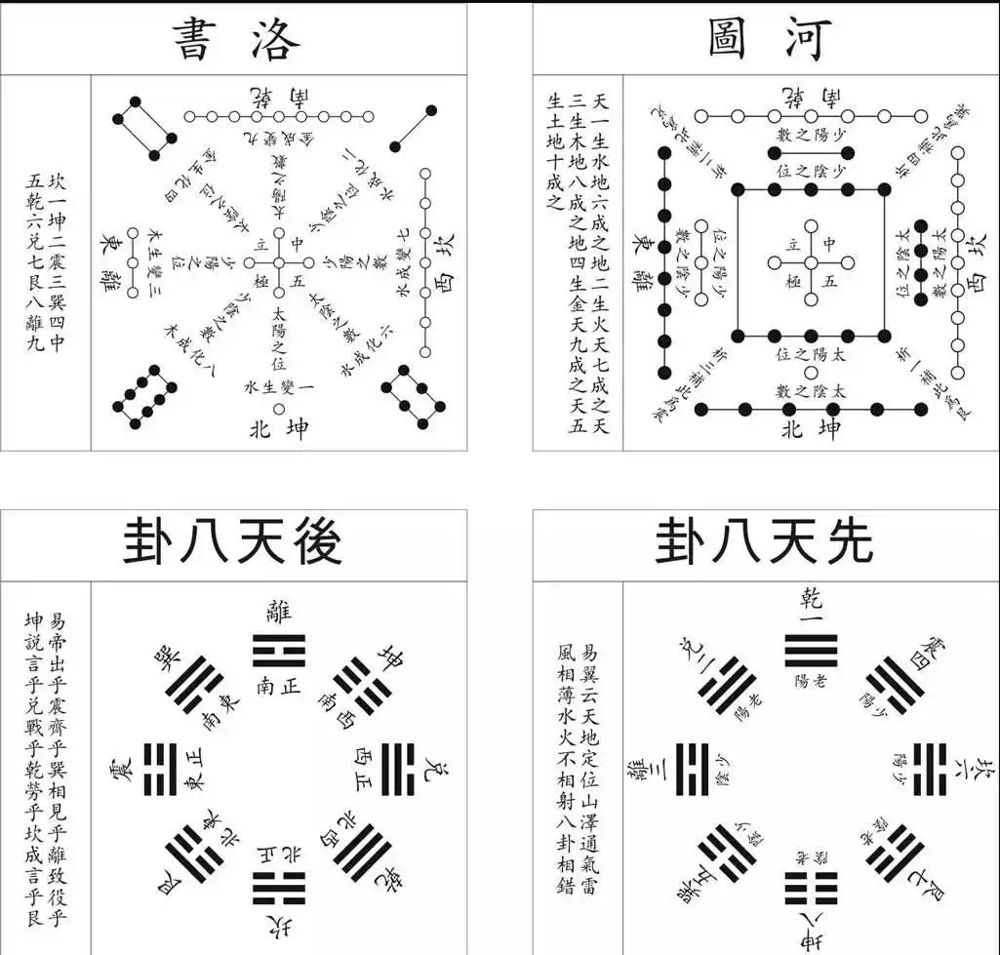
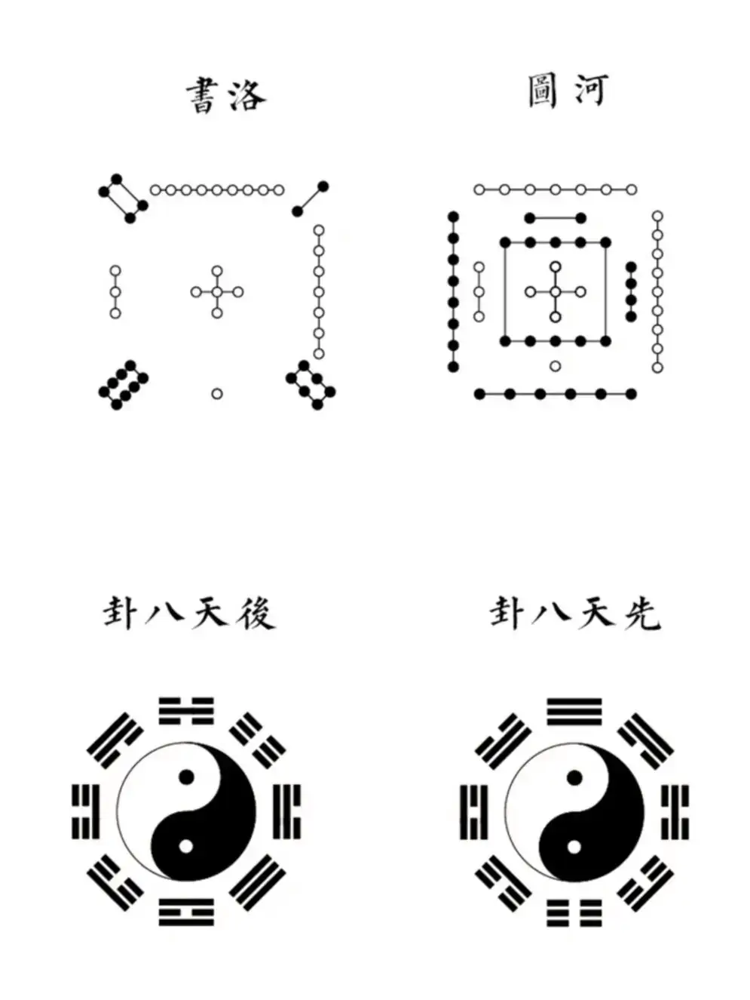
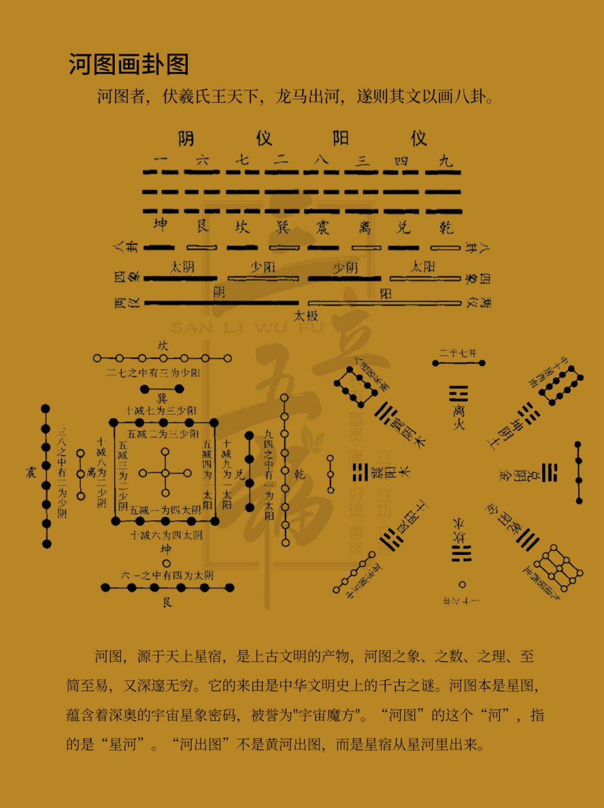

# 简介
## 河图洛书
 河图洛书，是中国古代流传下来的两幅神秘图案，蕴含了深奥的宇宙星象之理，被誉为"宇宙魔方"，<u>是中华文化、阴阳五行术数之源。</u>语出易经《系辞.上》，
>“河出图，洛出书”，河，黄河。洛，洛水。 

河图本是星图，其用为地理，故在天为象，在地成形也。在天为象乃三垣二十八宿，在地成形则**青龙、白虎、朱雀、玄武、明堂。**
河图之象、之数、之理、至简至易，又深邃无穷。河图上，排列成数阵的黑点和白点，蕴藏着无穷的奥秘。“洛书”之意，其实就是“脉络图”，是表述天地空间变化脉络的图案。洛书，它的内容表达实际上是空间的，包括整个水平空间、二维空间，以及东西南北这个方向。洛书上，纵、横、斜三条线上的三个数字，其和皆等于15。河图洛书是中华文化，阴阳五行术数之源。最早记录在《尚书》之中，其次在《易传》之中，诸子百家多有记述。
**太极、八卦、周易、六甲、九星、风水、等等皆可追源至此。**
河图、洛书最有名的出处来自于《易传·系辞》中的“河出图，洛出书，圣人则之”这句话，并据此认为八卦就是根据这二幅图推演而来的。第一次给这两幅图命名的是北宋易学家刘牧，他精研陈抟所传《龙图易》，著书《易数钩隐图》，于是，河图洛书才为世人所知。
## 创建此库的目的
收集存储易学相关资料。

